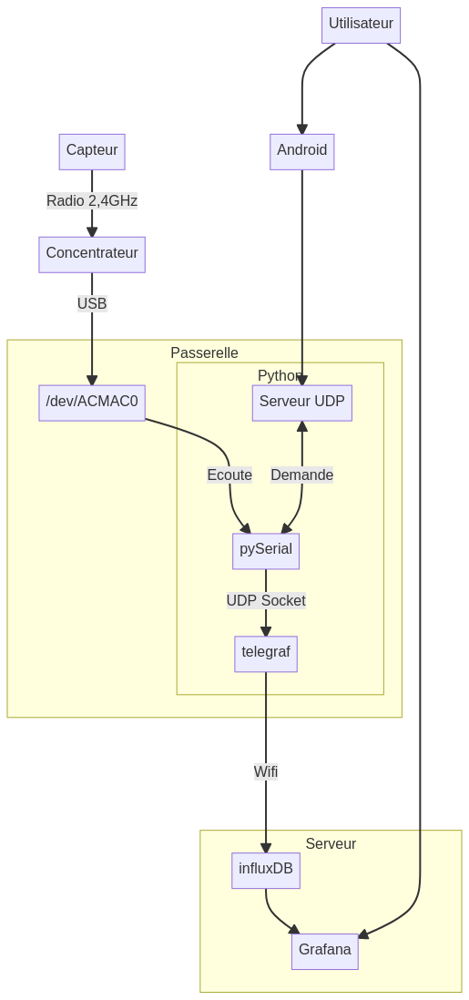
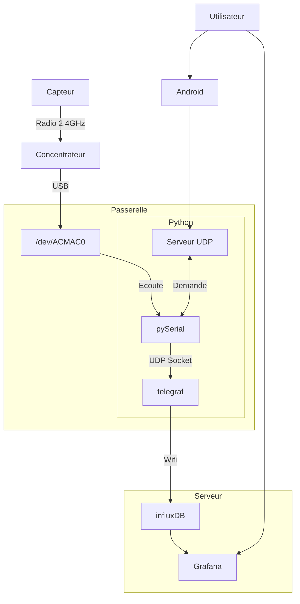

# Projet IoT 2021 
## Passerelle
###  CPE Lyon

#### Baptiste PELLARIN - Aurelien MOOTE - Marco DEGUEURCE - Pierre KHETTAL

```mermaid
flowchart TB
    Capteur --Radio 2,4GHz--> Concentrateur
    Concentrateur -- USB --> /dev/ACMAC0
    subgraph Passerelle
        direction RL
        /dev/ACMAC0 --Ecoute---> pySerial
        subgraph Python
            pySerial --UDP Socket--> telegraf
            A[Serveur UDP] <--Demande---> pySerial
        end
    end
    telegraf --Wifi---> influxDB
    subgraph Serveur
        influxDB --> Grafana
    end
    Utilisateur ---> Grafana
    Utilisateur ---> Android ---> A
```

